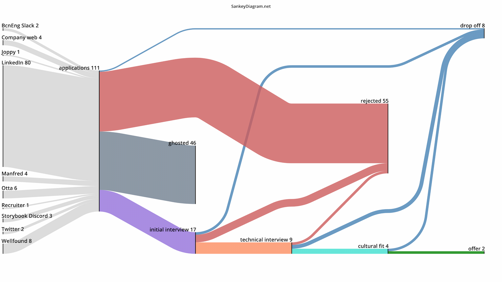

import newCV from '@/assets/OriolCastroArnau_CV.pdf'
import oldCV from '@/assets/OLD_OriolCastroArnau_CV.pdf'

In the last 5 years, I have been through 4 different hiring processes. From my very first one when I was a junior with zero professional experience as a developer to the last one a couple of months ago. Despite being in a theoretical better position because the accumulated experience I have, this last one has been the most difficult one.

The market is shifting, the economics are more turbulent, and at this moment finding a job in tech could be brutal to anyone. I will share with you all the numbers, what I did differently than before, and all the lessons I learned during this process with the hope it might help others.

**DISCLAIMER:** Every journey is different, and each person experience won't be the same. You should take everything in this post as they are, ideas and thoughts, and don't try to replicate it 100%, build your own path.

Let's cut straight to the cheese. Show me the data!!!

- First application 03/10/2023
- Accept the offer 15/11/2023
- Time from application to offer 4 weeks
- Number of applications 111
- Number of final offers 2

What happened to the 111 applications

Each selection process is different, but most of them could be generalized in 4 different phases.

- CV screening: right after you apply, the company will review (or not) your CV and decide if you are a good enough fit to star the process.
- Initial interview: a quick 30' call with someone from the hiring team. It's used to know you better, check your experience and general fit with the position.
- Technical assessment: the goal of this step is to evaluate your technical knowledge. This is the most diverging step between companies, from take-home tasks, to live coding exercises, online tests, or just technical discussions.
- Cultural fit: usually the last step of the process. A light chat with the team's management or the leadership of the company. It's used to know you personally and see if your values and attitude to work fits the company culture.

If everything has gone right, you just need to wait and/or negotiate an offer.

You now know the numbers, let's go through everything I learned at each phase.

## Track everything

In our work documentation is key and since looking for a new job was now my full time job I decided to track all applications in Notion. I have been refining this system since my first job hunt, so this is what I did.

Once I had found a job posting that matched what I was looking for I created a new entry in Notion with the company name, the position title, the salary range (if published), the source of the posting, the link to it and my priority. In total, I collected more than 100 postings during a couple of weeks of search.

Apart from the basic information, I used those entries to track the application status and the progress on the different steps. My retention capacity is low and writing down with whom I interviewed, what we talked about, what information I shared would be very useful down the line.

If you want to take inspiration, I have a link to a Notion template at the end of the article.

## Blind screening is brutal

Let's be honest, most of your applications will be rejected, or they will simply never respond.

Companies receive hundreds or thousands of applications for a single job position. This has been increasing due to the current economic situation, not as many jobs as before but more people looking for one.

The amount of time the hiring teams can dedicate to each application at this stage is minimum, so the screening process will be based on a few key items they decided to prioritize. Yes, a perfect match candidate might be discarded, but at this stage it's all a numbers game. Companies will try to select a few tens of profiles from hundreds, so you need to apply to as many as possible to increase your chances.

Something I learned during this phase is that being rejected sucks, specially with a bland, generic and depersonalized email. So, don't feel bad! Keep applying, you will get the chance to present yourself.

In the first round of applications, I didn't apply to all 111 the same week, I used the same CV I had been using for the last 5 years. It was simply, clean and short, just one page as some experts recommend. The ratio of initial interviews vs rejections/ghosting was really low.

<a href={oldCV} target="_blank" download>
  {'This was my old CV 😞'}
</a>

After getting a little frustrated, I talked with an ex-colleague that was just hired and a friend that
works in HR in a tech company. The take-over from the conversations was that I should showcase the best
of myself as a developer from the very first impression.

With those ideas, I redesigned my CV to include 3 key changes:

- A role/title that defined "what type of engineer" I am. This might match what the companies were looking.
- A list of highlights and key contributions from my previous jobs. They might not read it all of it, but they could get a first impression of "how I work and what I am good at".
- A list of key technologies I have used. Those might partially match what companies listed as required experience with in the offers.

All this information was already in my LinkedIn and website, but at this stage, most of the companies won't even bother doing some research about you. The CV is your main shot at making a good impression.

<a href={newCV} target="_blank" download>
  {'This is my new CV 😊'}
</a>

## Hi! My name is Oriol and I'am a product engineer

Congrats! You survived the first cut now is your time to shine. The initial interview might not seem important but it is the encounter that will set the tone for all the process.

- It can give you the first insight on how the company operates and its internal culture.
- It will clarify the company expectations for the position.
- It is the first impression that the person that will guide you during all the process will get from you.

One of the things I did was prepare every single one of those interviews. I did some research in the company, collected information about the product, teams, latest news, etc. I also prepared some questions, some specifically related to the position and other more generic about the company. And finally, I wrote down my "selling points" to make sure I present a profile that matched the position requirements. Also, I prepared "my personal history" speech as my journey into the development world and background could catch their attention and make me stand out.

## Let's talk about the technical tasks

It is a common practice in our industry to assess your technical level during a hiring process. The idea is quite reasonable, if you will be required to do some specific technical work, we should know you are capable of it. The issue is that this has been perverted, creating very bad experiences for candidates, useless insights for companies and an endless debate in the community.

During this round of process, I faced basically all possible combinations of technical tests. I think somewhere good, others were interesting and a bunch of others were disappointing.

What's my opinion to the debate? Let me share a few ideas I follow when I'm responsible for assessing the technical level of a candidate.

- The test should give you real world clues of how this person will work within your organization/team.
- Look for their thoughts process, how they defend technical decisions, what are their priorities, how they use the resources available, etc.
- You should invest a proportional amount of time to review the task compared to what you asked from the candidate.
- Always give feedback. And do it face-to-face, never by email, since the value of that feedback will almost be zero to the candidate.

I might write an article explaining more in details what was the process we established in Gigapipe and what's the one we are using now at Toddl.

## Turning the tables

Congrats! If you have survived past the technical assessment, and you are very close to complete the process. The last steps are not that standardized, but usually is what's called a "cultural fit". You will keep doing interviews, but at this point you are the one in control.

In my experience, these interviews are very relaxed and casual conversations. The goal is to see if your values and workspace culture match the ones from the company, and there is a good personal feeling. At this point you have proved everything required for the job, so relax and be yourself.

Some of the things I look for during these last "interviews" or try to lead the conversation are:

- To discover any red flag that I missed before.
- To found out If the values mentioned, so far, match the attitude and doings of those in leadership positions.
- To know what's the midterm vision for the team or company.
- To learn how is the day-to-day work and if I see myself working with/for these people.
- To discuss and clarify any blocker found during previous interviews (i.e. salary, work-life balance policies, etc.)

## Time to decide

"We would like you to join the team at XXX!" Receiving multiple emails with this subject is the ultimate end goal of all hiring process.

This time I was able to sync all the 111 processes I applied to, to get 2 offers within a week having 2 more completed process waiting for the companies to make an offer. I thought this was the perfect outcome until I started evaluating those offers to decide which one to accept. It was really difficult, especially because the economic aspects between them were not that different. How I decided then? I tried to project me into the future and visualize the challenges I would face in each job. Also, I reflected on where in my career I want to be in 5 years and what are the growing paths each company could put me through. Finally, I evaluated what risks would I assume in each opportunity and if I was willing to assume them.

Having multiple offers sounds nice, but I think is a double-side sword. You will need to reject all but one offers, and as we have experienced during this process, being the one rejected sucks.

## Links and resources

- [Notion template](https://ruddy-join-337.notion.site/b30b30d76ad44b29a2e40d5bc00e7b79?v=00c1976d869b43b5beb4b2423bb66593)
